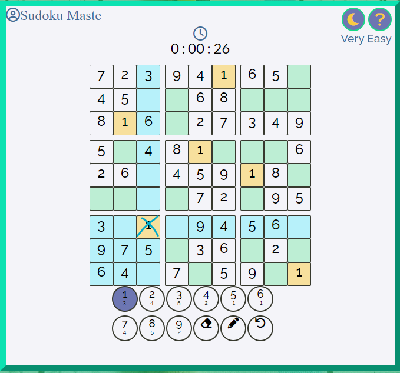
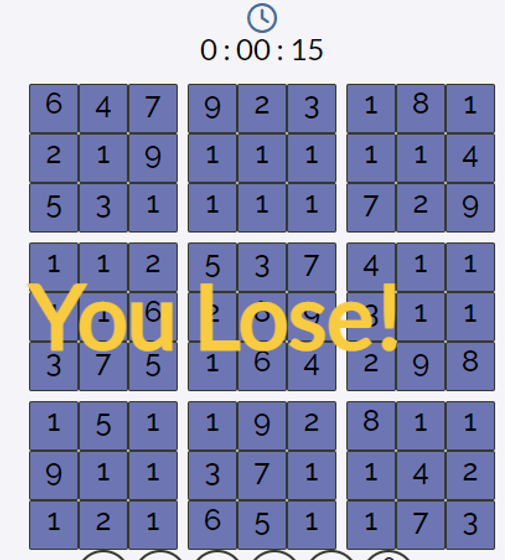

# Sudoku Master
Sudoku game website.

Link to [website](https://kristiancolville1.github.io/sudoku-master/)

## Table of Contents
* [Project Goals](#project-goals)
    * [User Goals](#user-goals)
    * [Site Owners Goals](#site-owners-goals)
* [User Experience](#user-experience-ux)
    * [Target Audience](#target-audience)
    * [User Requirements and Expectations](#user-requirements-and-expectations)
* [User Stories](#user-stories)
    * [Site User](#site-user)
    * [Site Owner](#site-owner)
* [Design](#design)
    * [Color Scheme](#color-scheme)
    * [Fonts](#color-scheme)
    * [Structure](#color-scheme)
    * [Wireframes](#wireframes)
* [Technologies & Tools](#technologies--tools)
* [Features](#features)
* [Validation](#validation)
    * [HTML Validation](#html-validation)
    * [CSS Validation](#css-validation)
    * [JavaScript Validation](#javascript-validation)
    * [Accessibility](#accessibility)
    * [Performance](#performance)
* [Testing](#testing)
    * [Device Testing](#device-testing)
    * [Browsers Tested](#browsers-tested)
    * [Testing User Stories](#testing-user-stories)
* [Bugs](#bugs)
* [Deployment](#deployment)
    * [Version Control](#version-control)
    * [GitHub Pages](#github-pages)
    * [Cloning this Repository](#cloning-this-repository)
* [credits](#credits)
* [Acknowledgements](#acknowledgements)

## Project Goals
The goal of this project was to create an interactive and user-friendly version of the popular game Sudoku.

### User Goals

- To play a puzzle-based game that is both challenging and easy to use
- Be able to choose exactly how challenging the game is

### Site Owners Goals

- Create a puzzle-based game that is engaging and challenging
- Create a visually attractive design
- Make navigating around the website simplistic
- Build a responsive and accessible website for all users of the website

[Back to the top](#table-of-contents)
## User Experience (UX)

### Target Audience

- This game can be played by anyone that enjoys puzzle-based games
- Any user who likes challenging number games with easy to understand rules

### User Requirements and Expectations

- Simplistic game rules
- Simplistic navigation through the website
- Responsive website that allows any user to play the game
- Actions that work as expected such as buttons or links
- A way to contact the developer responsible for creating the game
- Ease of accessibility for visually impaired users

[Back to the top](#table-of-contents)

## User Stories

### Site User

1. I want to be able to understand the rules of the game
2. I want to have the ability to enter my name and show it on screen while playing the game
3. I want the ability to choose how difficult the game is
4. I want to play the game by just clicking with the mouse
5. I want the ability to undo my last move in the game
6. I want the ability to see my position in the game
7. I want the ability to keep track of my guesses in the game
8. I want to see how long it takes me to solve the game
9. I want the ability to play the game in dark mode
10. I want to be able to contact the developer responsible for creating the game
11. I want to know that my message to the developer has been sent

### Site Owner

12. I want the user to understand the rules of the game
13. I want the user of the website to have the ability to choose difficulty settings
14. I want my website to be fully responsive so all users can play
15. I want a 404 error page to open in case the user enters a URL that does not exist within the website
16. I want the user to have the ability to contact me about the game and provide feedback for the game

[Back to the top](#table-of-contents)
## Design

### Color Scheme
The color scheme was inspired by the colors of the earth. Other colors were chosen for contrasting reasons between the various shades to add a cohesive style.

- For contrast reasons, the color black was used to increase accessibility scores in areas such as the footer

- The main colors in light mode are the default & they are specifically orientated around the color green. In dark mode, the darker colors are predominately shown with the lighter blue.

- The background image is also affected by the dark mode and has a soft light effect of green and then blue in dark mode.

### Fonts
[Google fonts](https://fonts.google.com/) were used and implemented in the website. After user feedback, I chose Raleway sans-serif and Lato sans-serif as my final two fonts for the website. I also found these fonts to be visually appealing and easy to read.

Handwriting fonts were initially considered in the design process but were not implemented after user feedback suggested they drastically affected the visual appeal of the site and were harder to read.

### Structure
The structure of the website was designed to be easily navigated. The whole game is within a single container directly in the centre of the screen. Each menu of the game appears on the screen only when needed.

- The game contains the following screens:

    - Home page with an instructions icon and dark mode icon in the top right corner, a welcome message with game title, and a user login
    - Next is a difficulty menu that informs the user to select a choice
    - The main game screen displays once the user selects a difficulty, it contains the user's name in the top left corner, a digital clock to count how long the user takes to solve the board, the numbers 1 through 9 for selection and three additional choices for eraser, pencil and undoing moves
    - Once the game is finished either by losing or winning the whole board turns the same color and a message appears informing the user of a win or lose
    - Additionally, another smaller screen appears shortly after to check if the user wishes to play another game or to change the difficulty
- If the user clicks the question mark a modal menu pops open showing game rules and basic instructions with a link to a sudoku Wikipedia page if the user needs more information about the game and how to play it
- I've also added a contact page form that allows users of the website to send an email through EmailJs to the developer responsible for creating the website so they can share feedback and provide insights
- In case the user enters a URL that does not exist within the site I have also added a 404 error page to display with a link to the home page

### Wireframes

Desktop and large screens

Tablet and medium screens

Mobile and smaller screens

[Back to the top](#table-of-contents)
## Technologies & Tools

### Languages Used

- [HTML](https://en.wikipedia.org/wiki/HTML)
- [CSS](https://en.wikipedia.org/wiki/CSS)
- [JavaScript](https://en.wikipedia.org/wiki/JavaScript)

### Frameworks, Libraries & Tools

- [Am I Responsive](http://ami.responsivedesign.is/) was used to generate an image showcasing the website's ability to adapt to different screen sizes at the start of this README.md file
- [Balsamiq](https://balsamiq.com/) was used to create wireframes for use during project development
- [Coolors](https://coolors.co/4e5340-697268-95a3a4-b7d1da-e2e8dd) to generate color palettes and root Hex codes
- [Chrome Developer Tools](https://developer.chrome.com/docs/devtools/) for making the site responsive and debugging the site in a browser
- [EmailJs](https://www.emailjs.com/) provided the ability for users to send email from the contact form
- [Favicon](https://favicon.io/) for the favicon in the website
- [Font Awesome](https://fontawesome.com/v5/search) for all icons within the website
- [Grammarly](https://app.grammarly.com/) for grammer and spell checking
- [Git](https://git-scm.com/) for version control within [VSCode](https://code.visualstudio.com/) to push commits to [GitHub](https://github.com/)
- [GitHub](https://github.com/) as a remote repository for project development
- [Google Fonts](https://fonts.google.com/) for the fonts used on the website
- [Jigsaw W3 Validator](https://jigsaw.w3.org/css-validator/) for validating CSS code
- [JShint](https://jshint.com/) for validating JavaScript code
- [Lighthouse](https://developers.google.com/web/tools/lighthouse) used within [Chrome Developer Tools](https://developer.chrome.com/docs/devtools/) for testing performance, accessibility, best practices, and search engine optimization
- [VSCode](https://code.visualstudio.com/) as a local repository
- [Wave Validator](https://wave.webaim.org/) for accessibility validation
- [WC3 Validator](https://validator.w3.org/) for validating HTML code

[Back to the top](#table-of-contents)
## Features

This website includes three web pages consisting of thirteen distinct features as described below.

### Home Page

#### Welcome title animation

- When the page is opened the game title fades into full opacity

See this feature

 

#### User name input

- The user is asked to provide their name into the input field for display in the game. The name the user enters needs to be at least 2 characters long and a maximum of 12 characters.
- There are no limits or restrictions implemented to prevent the user from entering characters of any type or name they wish to have displayed. If the user does not enter any input, however, then a message with feedback is displayed to inform the user of the name requirements.
- Then once a valid user name is provided, the name will be shown after a difficulty is picked on the next screen their name is next to a user icon at the top of the game screen in the left top corner
- User stories fulfilled: 2

See this feature

 

#### Instructions Menu

- A simple modal pop up with game instructions when the '?' icon is clicked on by the user
- It is available on game screens on the home page
- A link to a Wikipedia page about sudoku has also been provided for more information
- User stories fulfilled: 1, 12

See this feature

 

#### Difficulty Menu 

- Users can choose between six difficulties to exactly pick how challenging the game will be
- In order of difficulty:
    - Very Easy
    - Easy
    - Medium
    - Hard
    - Very Hard
    - Insane
- Once a user picks a difficulty the game starts
- User stories fulfilled: 3, 13

See this feature

 

#### Game Screen

- The game screen contains the following elements:
    - Users name
    - The chosen difficulty setting
    - Dark mode button
    - Instructions menu button
    - A digital clock to count the time
    - A sudoku grid
    - A number pad with options 1 through 9
    - Amounts left on board underneath the options 1 through 9
    - Options for eraser, pencil and undo move
- User stories fulfilled: 2, 4, 5, 6, 7, 8

See this feature

 

#### Dark Mode

- When the user selects the moon icon on the home page they activate the dark mode button
    - Users have the option to play the game in a darker contrast
    - When activated the icon changes to a sun icon
    - Intuitively highlighting night and day from the moon and the sun
- User stories fulfilled: 9

See this feature

#### Digital Clock

- User can see a digital clock counting the time directly above the center of the sudoku grid
    - Allows users to see how long the puzzle takes to solve
    - It counts from zero and can increment up to 600 hours
    - The format for the clock is 00:00:00
- User stories fulfilled: 8

See this feature

 

#### Sudoku Grid

- Provided is an incomplete sudoku board for the user to fill
    - Cells the user can change are highlighted with a different background-color
    - When the user clicks on the board their location is highlighted
        - Hovering over cells shows the mouse location
        - The 3x3 grid, vertically and horizontally are also highlighted on each click
    - When a user selects an option from the options list:
        - If the option is a number, all of those cells will highlight with a different background
- User stories fulfilled: 4, 6, 7, 8

See this feature

 

#### Pencil Options

- Users have options 1 through 9 to choose from to fill the grid
- Users also have 3 additional options for playing the game:
    - An eraser to empty a cell on the board
    - A pencil to mark guesses on the board
    - An undo button to undo all non-pencil moves
    - Tooltips to describe each pencil options purpose
- The user only needs to use their mouse to complete the game
- The amounts left on the board to fill are directly underneath the options 1 through 9
- User stories fulfilled: 4, 5, 7

See this feature

 

#### Win or Lose

- When the user fills the grid and there are no blank spaces on the board the game is over
- A win or lose message will appear on the screen
    - An animation has been added for the game message to get larger when triggered
    - After around 5 seconds the return menu pops up
        - The user can return to the start of the home page
        - They can play again
        - Or choose to change the difficulty setting

See this feature

 

#### Footer 

- Featured on all pages within Sudoku Master
- It provides:
    - Copyright for the creator Kristian Colville
    - Link to the Contact page
    - Link to the developers GitHub repository of this project
    - Link to the developer's LinkedIn profile
- All external links open in a separate window
- Internal link to the contact page opens in the same window
- User stories fulfilled: 10

See this feature

 

### Contact Page

#### Contact Form

- A user can provide feedback or get in touch with the developer through the contact form
- Implemented is [EmailJs](https://www.emailjs.com/) which allows a user to send an email to the developer with the user's data and message
- User stories fulfilled: 10, 16

See this feature

 

#### Contact Form Confirmation Message

- A thank you message is displayed
- Provides a link back to the home page
- User Stories fulfilled: 11

See this feature

 

### 404 error page

- This website has a 404 error page included which is displayed if a user enters a URL that does not exist within the website
- It provides a method for the user to return to the home page through a link
- User stories fulfilled: 15

See this feature

[Back to the top](#table-of-contents)
## Validation

### HTML Validation

To validate the HTML on all pages the [W3C Markup Validation Service](https://validator.w3.org/) was used. 
All pages passed with no errors.

Home Page

Contact Page

404 Error Page

 

### CSS Validation

To validate the CSS on all pages the [W3C Jigsaw CSS Validation Service](https://jigsaw.w3.org/css-validator/) was used. 
All CSS files passed with no errors.

style.css

contact.css

 

### JavaScript Validation

To validate the JavaScript, [JSHint](https://jshint.com/) was used. No errors or warnings in all JavaScript files.
JSHint was installed within [VSCode](https://code.visualstudio.com/) and enabled globally for quicker error detection at run time instead of manual copying and pasting files to the actual website.
All errors were resolved within VSCode instantly at the moment of the error if an error occurs.

- Files within workspace:
    - app.js
    - sudoku-board.js
    - contact.js

Workspace Results

 

### Accessibility

To test the accessibility of the website [Wave WebAIM](https://wave.webaim.org/) was used to ensure the website met high accessibility standards. The entire website passed with 0 errors.

Quick overview of things this tool helped accomplish to meet standards:

- Buttons were resized
- Font colors were adjusted for contrast
- Font sizes were made larger
- Backgrounds and foregrounds were adjusted for contrast
- Aria labels were checked and matched

Home Page

Contact Page

404 Error Page

 

### Performance

To test performance [Google Lighthouse](https://developers.google.com/web/tools/lighthouse) in [Google Chrome Developer Tools](https://developers.google.com/).
All scores show excellent results across the entire website. All results are either 100 or are in the high 90s.

Home Page

Contact Page

404 Error Page

 

[Back to the top](#table-of-contents)
## Testing

### Device Testing

Sudoku Master was tested on screens using - [Chrome Developer Tools](https://developer.chrome.com/docs/devtools/).
This tool was used to simulate different viewport sizes of the various devices.
The monitors were tested on the developer's screens. There is a generous amount of responsive design implemented. To accomplish this, [Flexbox](https://css-tricks.com/snippets/css/a-guide-to-flexbox/) was used in the CSS as the display type of the screens in the center of the web pages. It helped keep Media Queries to a minimum and provided an excellent method of sizing the screens and responding to the different viewports.

- Moto G4 (Mobile)
- iPhone SE (Mobile)
- iPhone XR (Mobile)
- iPhone 12 Pro (Mobile)
- Pixel 5 (mobile)
- Samsung Galaxy S8+ (Mobile)
- Samsung Galaxy S20 Ultra (Mobile)
- Samsung Galaxy A51/71 (Mobile)
- iPad Air (Tablet)
- iPad mini (Tablet)
- Surface Duo (Tablet)
- Samsung Galaxy Tab 7 (Tablet)
- Surface Pro 7 (Laptop)
- Azuze 32" monitor (Desktop)
- AOC 32" monitor (Desktop)

### Browsers Tested

- Testing has been carried out on the browsers listed below:
    - Google Chrome Version 98.0.4758.102 (Official Build) (64-bit)
    - Edge Version 99.0.1150.36 (Official build) (64-bit)
    - Firefox 98.0 (64-bit)

### Testing User Stories

1. I want to be able to understand the rules of the game

| Feature | Action | Expected Result | Actual Result |
| --- | --- | --- | --- |
| Instructions Button | Click the button | Intructions menu pops open for viewing when clicked | Works as expected |

See Screenshot

 

2. I want to have the ability to enter my name and show it on screen while playing the game

| Feature | Action | Expected Result | Actual Result |
| --- | --- | --- | --- |
| User name input | Enter user name | Type name between 2 and 12 characters and click next | Works as expected |

See Screenshot

 

3. I want the ability to choose how difficult the game is

| Feature | Action | Expected Result | Actual Result |
| --- | --- | --- | --- |
| Difficulty Menu | Select a difficulty option | clicking left or right to produce different difficulties | Works as expected |

See Screenshot

 

4. I want to play the game by just clicking with the mouse

| Feature | Action | Expected Result | Actual Result |
| --- | --- | --- | --- |
| User Mobility | Play the entire game with just the mouse | Complete a game using the mouse | Works as expected |

See Screenshot

 

5. I want the ability to undo my last move in the game

| Feature | Action | Expected Result | Actual Result |
| --- | --- | --- | --- |
| Undo icon | Remove the last move on the board | Entering a number and reversing the action | Works as expected |

See Screenshot

 

6. I want the ability to see my position in the game

| Feature | Action | Expected Result | Actual Result |
| --- | --- | --- | --- |
| Sudoku grid | Click a cell and have it highlighted | User clicks with mouse on board and cells should change background | Works as expected |

See Screenshot

 

7. I want the ability to keep track of my guesses in the game

| Feature | Action | Expected Result | Actual Result |
| --- | --- | --- | --- |
| Pencil Icon | Use the pencil to track guesses | Activate the pencil icon and a number and select a cell in the grid to pencil mark | Works as expected |

See Screenshot

 

8. I want to see how long it takes me to solve the game

| Feature | Action | Expected Result | Actual Result |
| --- | --- | --- | --- |
| Digital Clock | On the start of game clock should begin counting and be visable. It should also stop when game is finished | User can identify the clock and see how long it takes them to solve | Works as expected |

See Screenshot

 

9. I want the ability to play the game in dark mode

| Feature | Action | Expected Result | Actual Result |
| --- | --- | --- | --- |
| Dark mode button | Toggle darkmode icon to switch to a darker contrast | The background, foreground, fonts etc. should turn to darker colors on clicking the dark mode button | Works as expected |

See Screenshot

 

10. I want to be able to contact the developer responsible for creating the game

| Feature | Action | Expected Result | Actual Result |
| --- | --- | --- | --- |
| Contact page | Contacting the developer | User should be able to fill in a form for sending email to developer | Works as expected |

See Screenshot

 

11. I want to know that my message to the developer has been sent

| Feature | Action | Expected Result | Actual Result |
| --- | --- | --- | --- |
| Contact form confirmation | Notify the user the email has been sent | User clicks the send button, its value changes to 'sending' and a thank you message should appear | Works as expected |

See Screenshot

 

12. I want the user to understand the rules of the game

| Feature | Action | Expected Result | Actual Result |
| --- | --- | --- | --- |
| Instructions Menu  | Clicking the '?' icon in the top right corner | Once clicked a menu appears with simple instructions and link to a Wikipedia page | Works as expected |

See Screenshot

 

13. I want the user of the website to have the ability to choose difficulty settings

| Feature | Action | Expected Result | Actual Result |
| --- | --- | --- | --- |
| Difficulty Menu | Clicking left or right to navigate settings | When direction icons clicked on the difficulty should change | Works as expected |

See Screenshot

 

14. I want my website to be fully responsive so all users can play

| Feature | Action | Expected Result | Actual Result |
| --- | --- | --- | --- |
| Responsive design | Entering the website from devices of various sizes | The flexbox should adapt to the viewport and shrink elements accordingly | Works as expected |

See Screenshot

 

15. I want a 404 error page to open in case the user enters a URL that does not exist within the website

| Feature | Action | Expected Result | Actual Result |
| --- | --- | --- | --- |
| 404 Error page | Enter a URL that does not exist | When user enters a URL that does not exist the 404 error page should be displayed | Works as expected |

See Screenshot

 

16. I want the user to have the ability to contact me about the game and provide feedback for the game

| Feature | Action | Expected Result | Actual Result |
| --- | --- | --- | --- |
| Contact page | User send email to developer | EmailJs should notify the developer when a user sends email | Works as expected |

See Screenshot

 

[Back to the top](#table-of-contents)
## Bugs

|    Bug    |    Fix    |
| --- | --- |
| The second array I set up showed the players position in the wrong location between grids 5 & 9 | Created new array for indexes starting from 0 put the player's position in the correct location|
| Creating a backtracking algorithm to solve the board with one array for horizontal navigation | Using multiple arrays for the index helped simplify creating boards, without this, no boards could be created|
| The vertical array to hold the values generating the sudoku board not in the correct position | Swapping the outer index with the inner index positioned the value correctly |
| The 3x3 array to hold the values generating the sudoku board, not in the correct position | Removed code and started over |
| Generating 3x3 and horizontal values successful but vertical values conflicting | Removed code for vertically populating the grid |
| Grid was only capable of generating 12 random values successfully and it needs 17 to generate a single outcome each time | pushing the values generated vertically and horizontally to empty arrays for use later in conflict checking |
| Solving for the above bug has somehow generated another bug where the vertical and horizontal indexes are behaving, in the same manner, | Isolating the code in its own for loop solved the problem, the cell was not updating the previous values accordingly as the horizontal and 3x3 filled |
| Solving the board unsuccessful, values in wrong positions each time | Went with my fourth approach and removed all code and used a solved sudoku board to generate values correctly |
| Moving on from situations the boards are generating but the current issue is a user input to the board, I can successfully separate user input from the system numbers but once the user puts a number on the board it acts as a system number | I removed the classes from the spans and added them to the divs instead and used classList.Contains to locate them and decide the appropriate outcome so the user could not change the displayed numbers |
| Shaded cells not showing on pencil marks to help guide user | Added a function to check the inner cells each time user clicks on board and highlights these cells |
| When a user enters a number over a cell with pencil marks the highlighted cells show when no numbers to see | Added code to check if a user has entered a number on top of pencil marks and then empties that cell of pencil marks |
| Erased cells are showing highlighted background | Created separate strings with different values for the eraser and the actual blank space on the board |
| Pencil marks showing the same problem as above | Added a different blank string with two blank spaces to separate different inputs on the board |
| The inner pencil arrays can only hold 9 values or the numbers don't appear on smaller screens | Discovered the eraser was at fault and removed the ability to use it within pencil marks and only on top of them instead |
| Highlighted cells showing on top of pencil marks after undo button removes value in a cell if pencil marks underneath | Walked through code and discovered that the undo button adds the initial value back to board. Added code so if the initial value is a blank space just empty the pencil mark array underneath |
| If a user uses a pencil on a cell and then writes a number over it but decides to write with pencil on the same cell the pencil array not filling up correctly, only one value being displayed | Removed the nested if and else statements causing the issue from isOnBoard function and rewrote logic, the cells can be rewritten now |

[Back to the top](#table-of-contents)

## Deployment
### Version Control
I used [Visual Studio Code](https://code.visualstudio.com/) as a local repository and IDE & [GitHub](https://github.com/) as a remote repository.

1. Firstly, I needed to create a new repository on Github [sudoku-master](https://github.com/KristianColville1/sudoku-master).
2. I opened that repository on my local machine by copying the URL from that repository and cloning it from my IDE for use.
3. Visual Studio Code opened a new workspace for me.
4. I created files and folders to use.
5. To push my newly created files to GitHub I used the terminal by pressing Ctrl + shift + `.
6. A new terminal opened and then I used the below steps.

    - git add (name of the file) *This selects the file for the commit*
    - git commit -m "Commit message: (i.e. Initial commit)" *Allows the developer to assign a specific concise statement to the commit*
    - git push *The final command sends the code to GitHub*

### GitHub Pages
When I finished setting up my workstation and getting everything set up to use the repository I decided to deploy the website using [GitHub Pages](https://pages.github.com/). This is a resource a developer can use to test how their websites behave on a cloud platform. It's an excellent resource provided by GitHub to publicly display websites.

1. To begin, I went to the repository and selected 'settings.'

2. I went to the 'pages' section.

3. I chose the master branch as the 'main' branch under 'source.'

4. I ensured that it was deployed from the 'root' directory.

5. Once completed, I got the website's URL.

### Cloning this Repository
To clone this repository for use on your local machine please follow the below steps.

1. Navigate to the repository you wish to clone.

2. Click the green button labelled 'Code'.

3. Copy the URL under the HTTPS option.

4. Open an [IDE](https://www.codecademy.com/article/what-is-an-ide) of your choosing that has [Git](https://git-scm.com/) installed.

5. Then open a new terminal in your IDE.

6. Type this exactly: git clone the-URL-you-copied

7. Hit enter.

You now have a local copy of this repository to use on your machine.

[Back to the top](#table-of-contents)
## Credits

I sourced a function from [Mozilla. org](https://developer.mozilla.org/en-US/docs/Web/JavaScript/Reference/Global_Objects/Math/random) to generate some of my random numbers to help with the game logic.

I sourced a function from [StackOverFlow](https://stackoverflow.com/questions/2450954/how-to-randomize-shuffle-a-javascript-array) called the Fisher-Yates Shuffle. I needed a way of shuffling numbers quickly to help generate the game boards.

[Back to the top](#table-of-contents)
## Acknowledgements

[Spencer Barniball](https://github.com/5pence) for his mentorship and invaluable guidance.

[Kasia Bogucka](https://github.com/bezebee) for being the best cohort facilitator within [Code Institute](https://learn.codeinstitute.net).

[Code Institute](https://learn.codeinstitute.net) for providing me with the skills to complete this project.

[Back to the top](#table-of-contents)
